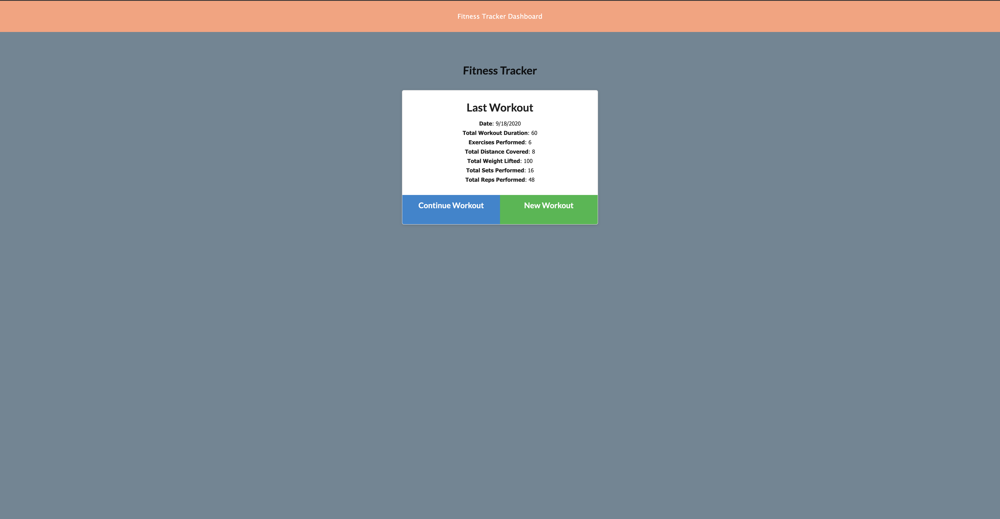

# Fitness-Tracker

 ## Image
 

  

  Contents of This File
  * [Description](#description)
  * [Technologies](#technologies)
  * [Installation](#installation)
  * [Contributors](#contributors)
  * [Tests](#tests)
  * [Questions](#questions)
  * [License](#license)

  # Description 
    Fitness Tracker application will give consumers the chance to  reach their fitness goals quicker by tracking their workout progress.

  ### Technologies:

  * Mongoose
  * MongodDb Atlas
  * express
  * Node.js
  * HTML
  * CSS
 ---

  ### Installation:

  * run on terminal (MacOS) or git bash (windows) 
  * npm install (npm i)

  #### Usage :

  * Clone repository 
  * install node.js

 #### License:
  
  ---

  #### Tests:
  NaN

  ### Contributors:
  Elham T.Hussain : https://github.com/ElhamFabe/Fitness-Tracker

 
  
 ---

  
